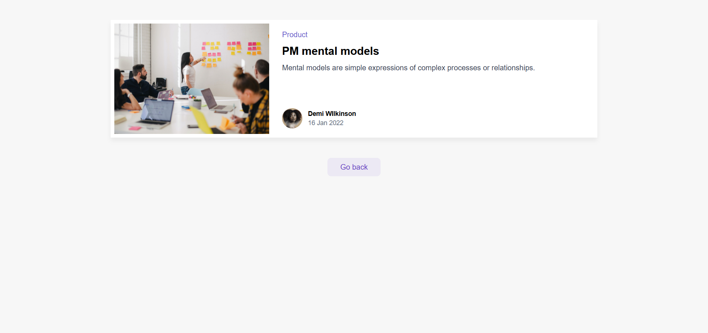

📑 DynamicBlog

DynamicBlog is a dynamic blogging project where each blog post has its own unique slug. When you click on any blog post, you are taken to a dedicated single post page that dynamically loads and displays the full content of that post.

- ✅ **Next.js** & **TypeScript**

✨ Features:

- Displays a list of blog posts with titles and summaries

- Uses dynamic URLs with slugs for each post (e.g., /blog/my-first-post)

- Loads the content of each post dynamically on its own single post page

- Responsive and user-friendly design

-------------------------------------   
📸 Screenshots

-------------------------------------
🚀 How to install and run
- git clone https://github.com/MisaqArtist7/DynamicBlog.git
- cd DynamicBlog
- npm install
- npm run dev
- Open http://localhost:3000 in your browser.

- Preview: https://dynamic-blog-ca25.vercel.app/

