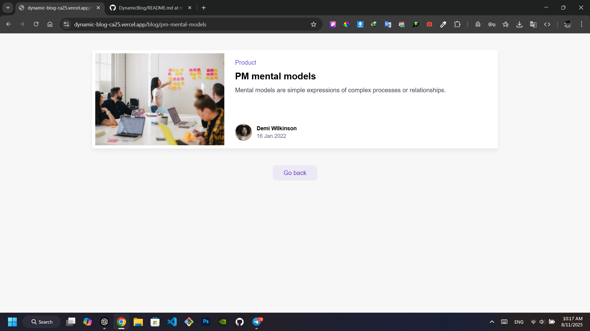

🛒 ShoppingCart APP

A modern and fully responsive Shopping Cart application built with:

- ✅ **Next.js** & **TypeScript**
- ⚛️ **Zustand** as a lightweight state management solution
- 💾 **LocalStorage** for persisting cart data

✨ Features

- 🛍️ Add products to the cart  
- ❌ Remove products from the cart  
- 🔢 View total items and price  
- 💾 Cart data persists using localStorage  
- 📱 Fully responsive design for all devices

-------------------------------------   
📸 Screenshots

-------------------------------------
🚀 How to install and run
- git clone https://github.com/MisaqArtist7/ShoppingCart.git
- cd ShoppingCart
- npm install
- npm run dev
- Open http://localhost:3000 in your browser.

- Preview: https://shopping-cart-phi-sage.vercel.app/

